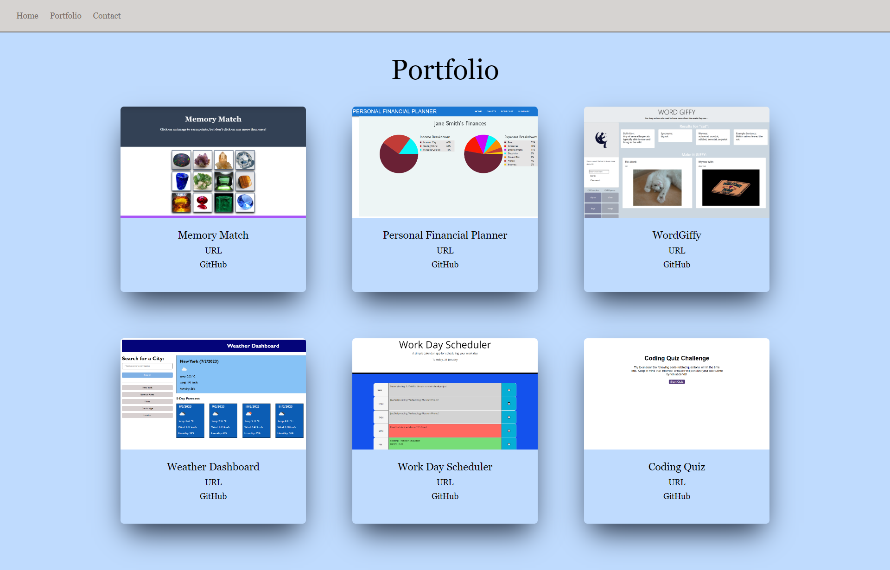

# David-Adams-Portfolio

## Description
The aim of this project was to create a portfolio to show samples of my work as a frontend developer. The portfolio was made using React router and styles with TailwindCSS. It contains a navbar and three page components: Home, Portfolio and Contact. The Home page provides a photograph and biographical information; the Portfolio provides project cards with screenshots and of various sample webpages along with links to their URLs and GitHub reposistories; and the Contact page provides social media links, links to my e-mail and CV and a form form sending a text message to one of my e-mail addresses. The project cards on the Portfolio page were made using the map method which looped over data objects held in a JSON file and applied these to a project card props component. A zoom animation was also applied to the cards, using Tailwind, so that each component increases in size by 10% upon hover. On the Contact page the npm emailjs-com package was employed to allow messages to be sent from a form to one of my e-mail addresses. The useState hook was also employed so that the user would be alerted of either empty inputs or an empty textarea within the form by changing the background color and placeholder message within the relevant element. useState was also employed to return these elements to default on click to allow the user to type in fresh text. The hamburger button which replaces the navbar in smaller screen formats is an icon from the react-icons npm package. A boolean useState hook is employed within the navbar component to allow the user to open and close a pop-up menu upon clicking the hamburger button by toggling the menu's position. When the menu is open it is position to the left of the page under the hamburger button; when it is closed it is displayed beyond the left-hand edge of the page.

## Installation
N/A

## Usage
N/A

## Credits
N/A

## License
N/A

## Tests
N/A

## Questions
If you have any questions regarding the repo, please contact me at dra21@cam.ac.uk.
You can find more of my work at [DavidBlueLamassu](https://github.com/DavidBlueLamassu).

## https://chipper-paprenjak-3a0c30.netlify.app/

